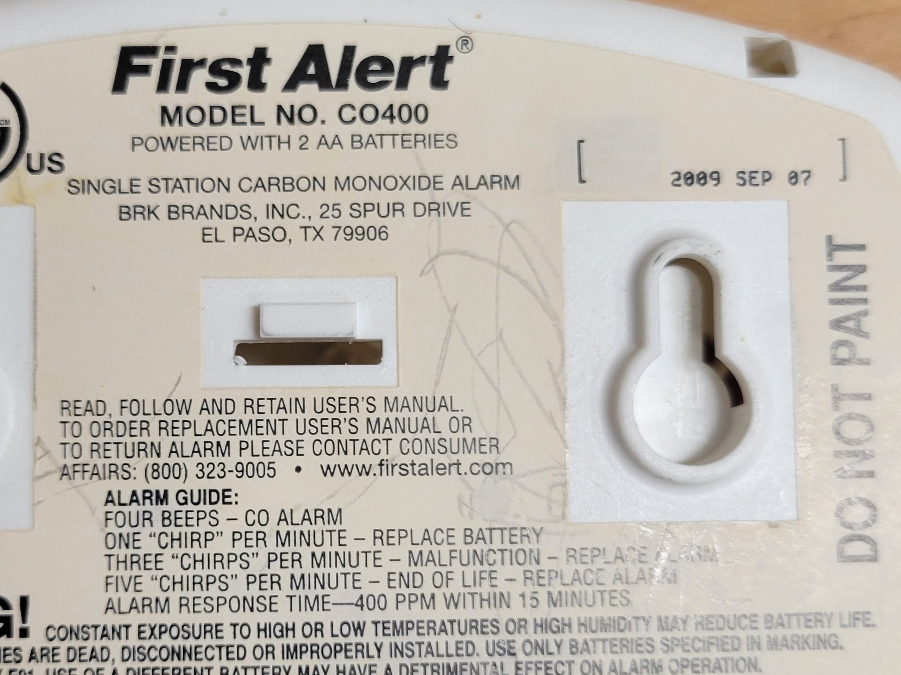
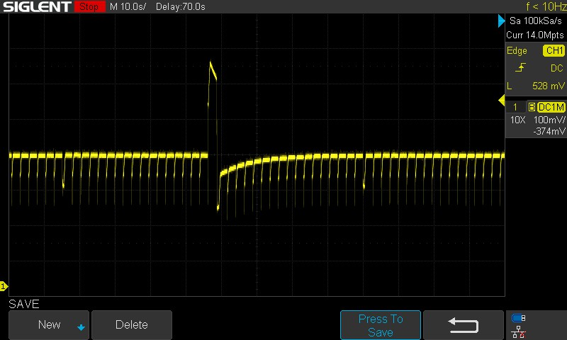
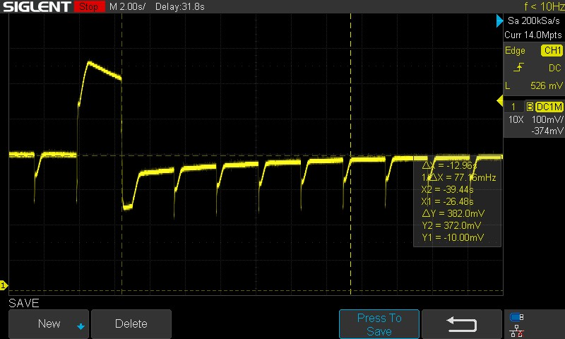
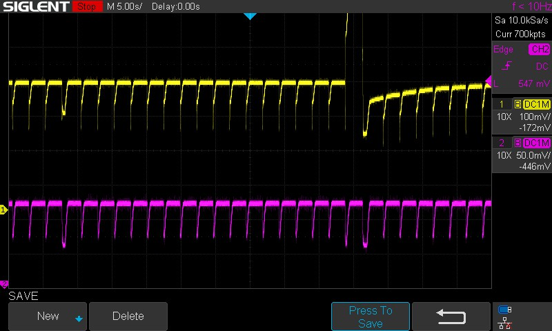
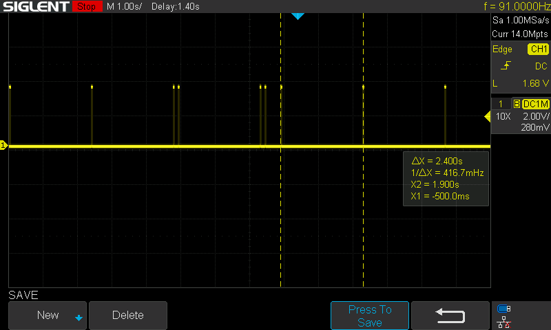
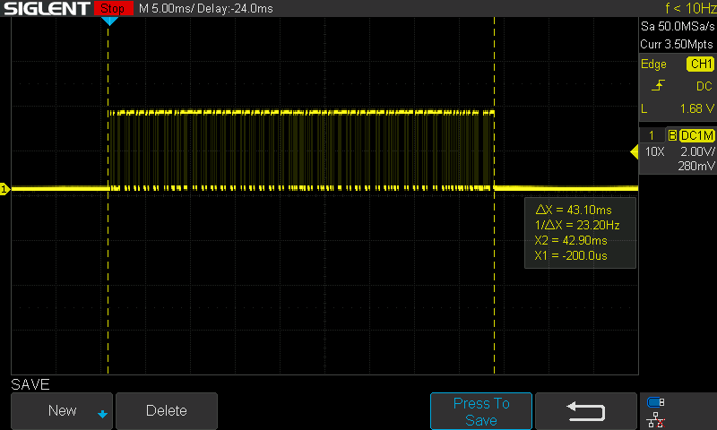
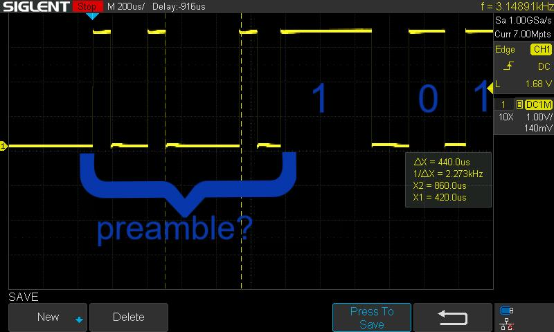

# First Alert CO Alarm (Model CO400) — Teardown  
*A Work in Progress*

<p align="center">
  
</p>

## Overview
This carbon‑monoxide alarm (circa 2009) recently reached its end‑of‑life. I wanted to see what made it tick and was surprised to find a beautifully engineered low‑power detection system — not just a humble consumer gadget but a miniature automated chemistry lab with a fuel‑cell sensor.  

It was manufactured by **BRK Brands, Inc.**, so the same design likely appears in other First Alert CO detectors.

<p align="center">
  
</p>

The date code is **2009 SEP 7**, and the IC date codes match that timeframe. The unit was signaling the five‑chirps‑per‑minute end‑of‑life warning.

---

## Hardware Description
The hardware combines familiar building blocks with a few surprises.

<p align="center">
  
</p>

### One moment please…
I expected a simple thermal gas sensor tied to a piezo beeper, but curiosity won — so, a **bigclivedotcom‑style** teardown it is!  
Tracing this “simple” PCB turned out to be anything but simple; it took several hours over a few days. I’m confident in most of it, but assume a margin of error — take it with a ~~pinch~~ pound of salt.

### Major Hardware
- **TGS‑5042** — CO sensor  
- **PIC16F88** — Microcontroller  
- **MCP6042** — Operational amplifier  
- **RE46C107** — DC‑DC converter, voltage regulator, and piezo horn driver  

### Details and Test Software
- **Schematics** — Reverse‑engineered PCB  
- **Serial Data?** — Maybe… sort of  
- **Software** — For further investigation  

---

## Figaro TGS‑5042 Sensor
<p align="center">
  
</p>

When I first saw this module, I thought it was a battery — and there *were* a few millivolts across the terminals. But this is the sensor itself: a miniature fuel‑cell‑type electrochemical device that outputs a tiny current linearly proportional to carbon‑monoxide concentration. Seeing voltage on the pins with the board unpowered is completely normal for this component.

### It Has a Fuel Cell?
Yes — the **TGS‑5042** is literally a fuel cell. It contains an alkaline electrolyte and an internal water reservoir. When CO or residual gases reach the electrodes, the cell generates micro‑volts and nanoamps of current. Over roughly ten years, the electrolyte and reservoir dry out — which is likely the state of this unit now. The datasheet has excellent detail if you want to dive deeper.

### Remember the Number: 1642
Each sensor has a printed calibration number and matching barcode. Mine reads **1642**, meaning:

**1.642 nA per ppm of CO**

So for every 1 ppm of CO, the sensor outputs 1.642 nA. I’ll cover how the op‑amp interface converts this into a measurable voltage later.

The other printed code, **090810**, is the lot date: **10 August 2009**, matching the unit’s manufacturing timeframe.


## PIC16F688 (U2) Microcontroller Chip
<p align="center">
  
</p>

Spotting this chip on the board is like being handed the decoder ring for the whole system. Even though we can’t extract the firmware, the pinout tells us a lot about how the device works.  
*(Side note: does the “D” stamped on TP1 mean “data tested”? Still not sure.)*

### Features
The **PIC16F688** is a 14‑pin, 8‑bit CMOS microcontroller from Microchip’s nanoWatt family — perfect for a battery‑powered safety device.  

Key features and functions in this circuit:
- 7 KB Flash, 256 B SRAM, 256 B EEPROM  
- Operates from 2.0 V to 5.5 V  
- Can selectively power down peripherals (thermistor, op‑amps, etc.) to conserve battery  
- Includes a clever power‑cycle circuit: an NPN transistor (**Q1**, PN2222) briefly pulls the battery line down through **R6**, controlled by **AN3** — likely part of a watchdog or self‑test routine  
- Pulses the horn through **U1 (pin 14)** via **RC4**, also handling built‑in tests  
- Controls the LED (**D4**) and thermistor (**TH1**) simultaneously by pulling **RC0** low  
- **SW1** is the TEST/SILENCE button connected to **RC5**  
- **Vbatt** is monitored on **AN5** for battery‑voltage measurement  
- A self‑test circuit involving **D1**, **R2**, **R12**, and **C12** appears to use Vbatt and is controlled by **RC3** and **RC4** (the same signal that enables the siren).  
  ~~TODO: Retrace this circuit to find out what it does.~~ **Done! See Note (6).**

---

## MCP6042 (U3) Operational Amplifier
<p align="center">
  
</p>

### Score!
When a chip company gets selected for a product, they earn a “socket.” **Microchip** scored two here — the **PIC16F688** and the **MCP6042**.  
The **MCP6042** is a high‑performance dual operational amplifier used as a **transimpedance amplifier (TIA)** to convert the sensor’s current into voltage. In this configuration, the sensor current flows through the feedback resistor, and the output voltage equals the input current multiplied by that resistor’s value.  

Its impedance characteristics and gain‑bandwidth make it ideal for sensor‑conditioning applications like this one. We’ll dig deeper into the circuit details later.

### Key Specifications
- Dual amplifier in an 8‑pin DIP package  
- Low quiescent current: < 1 µA (600 nA per amplifier typical)  
- Wide supply voltage range: 1.4 V to 6.0 V  

The 1 MΩ resistor and 100 nF capacitor visible in the photo match the reference circuit from the **TGS‑5042** sensor documentation.


## RE46C107 (U1) DC‑DC Converter, Voltage Regulator & Piezo Horn Driver
This is a multipurpose specialty chip — and a fascinating one.

The **RE46C107**, manufactured by **R&E International** (a subsidiary of **Microchip Technology Inc.**), is an ASIC designed for 3 V battery‑powered products such as smoke and CO alarms.  
That makes it the **third Microchip “socket win”** on this board.

<p align="center">
  
</p>

### Hidden in Plain Sight
This chip sits directly under the piezo horn. I had to remove the transducer to reveal it — the 16‑pin DIP on the left side of the board is the **RE46C107**.

### Alarming
The circuit includes a DC‑to‑DC up‑converter and driver suitable for piezoelectric horns.  
That’s how the alarm achieves such a loud siren from just two AA batteries — meeting the required dB level for safety devices.

### Boost It!
A selectable 3.0 V or 3.3 V regulator provides a 5 V output for logic circuits.  
This design uses the **3.3 V** setting.

### Not Used
The chip also includes an **LED driver** and **low‑battery detection**, but those features weren’t implemented in this model.

<p align="center">
  
</p>

### Scope Out the Supporting Parts
This microscope photo shows the inductor. I tried to identify its value — likely 10 µH, matching the typical application circuit.  
A pair of rectifier diodes were installed with markings facing down; specs call for a **Schottky diode**, so I used a **1N5818** for testing. Another diode appears in the processor test circuit, unrelated to this chip, and I used the same part there.

**App Notes:**
- Inductor L1 should handle ≥ 1.5 A peak current and < 0.3 Ω DC resistance.  
- Schottky diode D1 should handle ≥ 1.5 A peak current and < 0.5 V forward drop at 1 A.

### Key Specifications
- Low quiescent current — optimized for battery life  
- 10 V boost converter — impressive output from 3 V input  
- Horn driver — complementary outputs HS and HB connect to the piezo transducer, with feedback  
- Voltage regulation — selectable 3.0 V or 3.3 V logic rail  
- Optional +5 V regulator for microcontroller logic  
- Low‑battery detection (*unused*)  
- LED driver (*unused*)


## Methods to My Madness: Capturing the Schematic
Having the datasheets and reference circuits made this much easier. The following two pictures helped map the board.

<p align="center">
  
</p>

The solder side is mirrored and contrast‑enhanced — like viewing the board through the component side.

<p align="center">
  
</p>

### X‑Ray Vision
The plan was to overlay the component side semi‑transparent over the mirrored solder side to trace connections visually. I didn’t have editing software that could handle layers, so no literal X‑ray vision — just persistence.

I drew component outlines on a printout of the solder side and used continuity checks on my DMM. The contrast‑enhanced black‑and‑white printout, scaled up slightly, helped a lot — though an actual X‑ray view would’ve been better.

### Buzzed It Out
Using the multimeter, I did point‑to‑point continuity tests and captured the circuits in KiCad, guided by reference schematics.  
Starting from the solder side occasionally flipped pin numbering, but cross‑checking against datasheets made corrections easy. Component values were assigned later using markings and measurements.

### Board Takeover!
I considered reprogramming the **PIC16F688** controller. My theory: an end‑of‑life timer halts normal operation, but the CO sensor might still respond.  
The plan was to unsolder the chip and install a 14‑pin socket — allowing off‑board programming and easy jumper access to an Arduino for sensor testing. Alternatively, short jumper wires to the pads could connect to a breadboard.  If you are interested, there are some proto arduino sketches in the **analog-prototype** folder

### DFM & DFT
Tracing was occasionally confusing — many pads had no components, and some leads passed over unused pads. These are likely factory programming or calibration points, part of **Design for Manufacturing (DFM)**.

Two large holes labeled **DAT1** and **DAT2** aren’t mounting holes; they’re probably datum holes for alignment pins on a pogo‑pin “bed‑of‑nails” fixture.  
That suggests all **In‑Circuit Programming (ICP)** signals are accessible there. I later confirmed pin‑prick marks centered on most pads.

**Design for Test (DFT)** also appears throughout — plenty of built‑in test circuits.

### Not My Problem
My goal was understanding, not replication.  
~~There were schematic errors I planned to fix and questions about power distribution.~~ **Done — mostly addressed.**

### The Schematic
Here’s the result. It’s not perfect, but it captures the essence of the design.  
I may update it if I find new details, but again — this was never meant to reproduce the detector.

<p align="center">
  
</p>

~~Schematic TODO: Verify U3 V+ voltage and voltage @ R17 — critical for ADC sensor reading.~~ **DONE** Notes (1) (2) (3)

### Post‑Apocalyptic?
Maybe this schematic will help someone build their next **post‑apocalyptic tricorder junk‑tech project**.  

---

## Circuit Analysis
Most of the circuits were introduced earlier, but this section dives deeper into how the **Figaro TGS‑5042** sensor (schematic U4, board SEN 1) is read — the heart of the device.  

Because this is a safety system, it includes **Built‑In System Tests (BIST)** to meet regulatory requirements. I’ll outline the math behind the sensor readings and how the microcontroller interprets them.

The sensor’s output current is tiny — on the order of nanoamps — so the circuit must convert it to voltage for the ADC. It’s basically Ohm’s Law, but at a scale of  $$\frac{1}{\ 1,000,000,000}$$ of an amp!

---

### 1. Sensor Current to Output Voltage ($V_{out}$)
The sensor generates a minute current proportional to gas concentration. An operational amplifier or load resistor converts this current into a measurable voltage.

### 2. Calculating Sensor Current ($I_s$)
To derive the raw sensor current (A) from the measured output voltage:

$$\[I_s = \frac{V_{out} - 1.0}{1.0\times 10^6}\]$$

### 3. Carbon Monoxide (CO) Concentration Calculation
To determine the absolute CO gas concentration in parts per million (ppm), divide the sensor output current by the sensor's individual sensitivity coefficient (measured in nA/ppm and found printed on the sensor's barcode).

$$\text{CO Concentration (ppm)} = \frac{\text{Sensor Output Current (nA)}}{\text{Sensor Sensitivity (nA/ppm)}}$$ 

### 4. Figaro Reference Formula
The official Figaro EM5042A evaluation circuit applies a fixed amplification factor of: 1,000,000 producing a 1.0 V baseline offset in clean air:

$$\[V_{out} (\text{Concentration} × \text{Sensitivity}) + 1.0\]$$

### 5. Microprocessor Measurement Resolution
To estimate the minimum measurable CO step for a given ADC:

$$\\text{Resolution} = \frac{C_{max}}{2^M × B_{min}}
\$$

*where:*  
  • Cmax = maximum CO concentration  
  • M = ADC bit depth  
  • Bmin = minimum distinct digital bits  

---

## Interface Circuitry & Theory of Operation
The **TGS‑5042** sensor’s current is processed through two stages of the **MCP6042** dual op‑amp, each with its own diagnostic function.

<p align="center">
  
</p>

### 1. Anti‑Polarization Shunt Circuit
- 100 kΩ resistor (R15) across Working Electrode (WE) and Counter Electrode (CE).  
- Prevents polarization damage when power is off by keeping WE–CE potential at 0 V.  
~~TODO: Check this resistor value — measurement interference possible.~~ **DONE! Note (5).**

### 2. Stage 1: Transimpedance Amplifier (TIA)
- **U3A** pins 1–3, 1 MΩ feedback resistor (R3), 100 nF capacitor, 2.2 kΩ (R4) and 220 Ω (R11) isolation resistors.  
- Converts sensor current to voltage: 1 nA → 1 mV.  
- 100 nF capacitor filters noise; isolation resistors protect op‑amp inputs.

### 3. Sensor Diagnostic Test 1 (RA5)
- MCU pin → diode (D2) → 1 MΩ (R5) → U3A pin 3.  
- Normal mode: MCU holds pin HIGH or High‑Z, reverse biasing D2.  
- Self‑test: MCU drives LOW, forcing current through R5; op‑amp output rises predictably, verifying loop integrity.

### 4. Inter‑Stage RC Filter
- 240 Ω (R14) series resistor + 100 nF (C8) to ground.  
- Low‑pass filter between U3A output and U3B input, removing high‑frequency noise.

### 5. Stage 2: Voltage Buffer & Baseline Offset
- **U3B** pins 5–7 configured as buffer.  
- Voltage divider (470 kΩ R17 to Vcc, 47 kΩ R16 to GND) sets baseline offset ≈ clean‑air voltage.  
- Prevents negative drift from clipping at 0 V, ensuring ADC captures full range.

### 6. ADC / Buffer Validation Circuit 2 (RA1/AN1)
- MCU pin → 10 kΩ (R1) → U3B pin 6.  
- **Dual function:**  
  1. Injects test voltage to verify buffer and ADC path.  
  2. Accelerates sensor warm‑up by pre‑charging filter node (~560 µs pulse).  

---

## Analog Waveforms
Now that the circuit operation is clear, let’s look at the analog waveforms — the heartbeat of this board in action.

<p align="center">
  
</p>

### Under Control
In this scope trace, the steady line represents the sensor’s “clean‑air” voltage. The recurring pulses every ≈ 2.4 seconds are timing and LED pulses, The wider gaps coincide with LED flashes — roughly every 20 cycles.

### Old But Still Looking Good
The large jumps are almost certainly sensor self‑tests: the big jump correspond to the self‑test bits described earlier (**3**, **6**).  
When the MCU pins go high‑impedance, the TIA output shifts, dropping the buffer output. a two‑pulse step followed by a deep down‑pulse. The slope of the recovery back to baseline shows the sensor is still active — about 12.9 seconds to recover.  That curve indicates the electrolyte is aging but functional; a failed sensor would show no recovery curve at all.

### It’s Alive!
So this 2009‑vintage sensor still detects CO. The device’s 10‑year timer “kill switch” hasn’t been triggered.

<p align="center">
  
</p>

Here’s a closer view of the sensor test and recovery waveform. The 12.9‑second recovery time is measured between cursors. Everything happens slowly — in seconds. The ramp‑up slopes likely come from the TIA feedback capacitor charging.

<p align="center">
  
</p>

This trace shows both the sensor and thermistor voltages (lower trace). The thermistor voltage is valid only when the LED is on — roughly once per minute.  
That confirms thermistor readings occur during those longer dips. The 2.4‑second cadence matches the timing of data packets, suggesting the LED cycle may drive the sampling rhythm.

---

## Data Stream at TP1
The “serial” data is fascinating — it reveals how the device communicates internally. I started by probing TP1 with the oscilloscope to capture timing and verify real data frames.

<p align="center">
  
</p>

Packets are 3.3 V logic‑level safe for Arduino inputs. The most common spacing is ≈ 2.5 seconds, but every 20 or so there are shorter gaps between them matching the LED blink rate.

<p align="center">
  
</p>

A typical packet lasts ≈ 40 ms, though timing varies. When I examined bit widths to estimate baud rate, I found they were too regular — not standard serial timing. So what protocol is this?

<p align="center">
  
</p>

### The Preamble
At the start of each packet, three short pulses and one long gap appear — too brief for normal bits. After some digging, I found a patent describing this exact signaling method for CO and smoke alarms: **“rattle bits.”**  
It fits this implementation closely.

Armed with that, I wrote an Arduino sketch to log raw frames:  
**CO400 RAW PWM FRAME LOGGER v0.4.4** — now at revision 4.

Sample output:

```
?t=4777 ms Bits=65 FRAME: 0x55 0x40 0x95 0x2A 0x10 0x05 0x94 0x00 | STATE=NORMAL
?t=4772 ms Bits=66 FRAME: 0x55 0x40 0x95 0x2A 0x10 0x25 0x28 0x01 | STATE=NORMAL
BURST led=1 horn=0
```

### Issues and Answers
Three observations:
1. The 4777 ms interval is about twice the scope timing — likely skipping every other packet.  
2. Packet length averages 64 bits (8 bytes) as expected.  
3. The last two bytes track sensor test and recovery; 0x94 appears to be the “clear‑air” level.

### It’s PWM Data
The packet decode is consistent — not noise. It’s roughly 80–90 % decoded, though polarity and checksum remain uncertain. The preamble may also be `0xAA 0x55 0xB5…`.  
As always, the last 20 % takes 80 % of the time to perfect.

### Never Meant to Be Seen
The patent doesn’t list full codes, except `10100101` (0xA5) for a CO alarm. We haven’t seen that yet — perhaps it appears only during an actual alarm. This may even be factory test data never meant for external access.

### Suggested Tests
To correlate packets with real‑world events:
- Manual Test Button  
- Thermistor Test  
- Low‑Battery Simulation  
- CO Exposure Test  
- Anything else?

To match packets with visible behavior, I also tapped the LED and alarm lines. The LED blinks about once per minute, so thermistor readings occur only during that active‑low period.  
Battery‑voltage sampling is slower — several minutes between low‑battery indications — but distinct bit changes appear when it happens.

---

## Inconclusive Conclusions
With the test software undersampling (every other packet) and variable packet lengths, the only certainty so far is that the first byte never changes — an alternating bit pattern that likely serves as a sync or device ID.  

---

## Final Summary and Next Steps
After all this probing, tracing, and decoding, the **CO400** reveals itself as a surprisingly sophisticated little system — a self‑contained electrochemical lab powered by two AA cells.  

Even after fifteen years, the sensor still responds, the analog front‑end behaves exactly as the datasheets predict, and the microcontroller continues its quiet rhythm of self‑tests and data packets. The “five‑chirps‑per‑minute” end‑of‑life warning seems to be purely time‑based, not an actual sensor failure.

### What We Know
- The **TGS‑5042** sensor is a true fuel‑cell‑type electrochemical detector.  
- The **MCP6042** op‑amp converts nanoamp currents into stable voltages with built‑in diagnostics.  
- The **PIC16F688** microcontroller orchestrates sampling, self‑tests, and communication.  
- The **RE46C107** handles power regulation and horn driving with impressive efficiency.  
- The data stream at TP1 is a proprietary PWM protocol — likely factory test or inter‑device signaling.  

### What’s Next
There’s still plenty to explore:
- Decode the remaining packet bits and confirm their meaning.  
- Simulate CO exposure to see how the sensor curve changes.  
- Try re‑using the sensor and analog front‑end with an Arduino or Teensy for open‑source CO monitoring.  
- Document the timing relationships between LED, thermistor, and packet transmission more precisely.  

### Closing Thoughts
This teardown turned out to be far more than a curiosity project — it’s a glimpse into how much engineering goes into something most people never think about until it chirps.  
Even in retirement, this little alarm still teaches lessons about low‑power design, analog precision, and the elegance of simple circuits doing serious work.

--

# Notes & References

## Notes
1. **U3 Supply Voltage (Op‑Amp Rail)**  
   Verified that the MCP6042 receives the regulated 3.3 V rail from the RE46C107. This ensures the TIA output never exceeds ADC limits.

2. **R17 Divider Voltage**  
   The R17/R16 divider produces a baseline offset of approximately 0.30–0.32 V at U3B pin 5. This matches the Figaro EM5042A reference design.

3. **ADC Reference Behavior**  
   The PIC16F688 uses Vdd as the ADC reference. With a 3.3 V rail, each ADC step is ~3.22 mV. Combined with the 1 MΩ TIA gain, this yields ~3.22 nA per LSB.

4. **Sensor Recovery Curve**  
   The 12.9‑second recovery slope matches the Figaro datasheet’s expected time constant for an aging but still‑functional TGS‑5042.

5. **Anti‑Polarization Resistor (R15)**  
   Confirmed 100 kΩ via color code. Direct measurement is unreliable because the sensor generates its own micro‑voltage when disconnected.

6. **Self‑Test Circuit (D1, R2, R12, C12)**  
   This network injects a controlled load on the Vbatt line during horn‑test cycles. The PIC monitors the resulting voltage dip to verify battery health and internal resistance.

---

## References

### Datasheets & Application Notes
- **Figaro TGS‑5042 CO Sensor**  
  EM5042A Evaluation Module Application Notes  
  TGS‑5042 Product Datasheet  

- **Microchip PIC16F688**  
  PIC16F688 8‑bit Microcontroller Datasheet  
  ADC Module Reference  

- **Microchip MCP6042**  
  MCP6041/2/3/4 Low‑Power Op‑Amp Family Datasheet  
  Application Note: Transimpedance Amplifier Design  

- **R&E / Microchip RE46C107**  
  RE46C107 Smoke/CO Alarm ASIC Datasheet  
  Typical Application Circuit (Boost + Horn Driver)

### Patents
- **Inter‑Alarm Communication Using PWM “Rattle Bits”**  
  U.S. Patent covering encoded inter‑device signaling for smoke/CO alarms.  
  (Matches the preamble and bit‑timing behavior observed at TP1.)

### Additional Resources
- BigClive teardown style inspiration  
- KiCad schematic capture  
- Oscilloscope captures from SDS1104X‑E  
- Arduino “CO400 RAW PWM FRAME LOGGER v0.4.4” (custom tool)


## License

- **Code** is licensed under the MIT License (see `LICENSE`)
- **Documentation** is licensed under CC‑BY‑4.0 (see `LICENSE-docs`)

