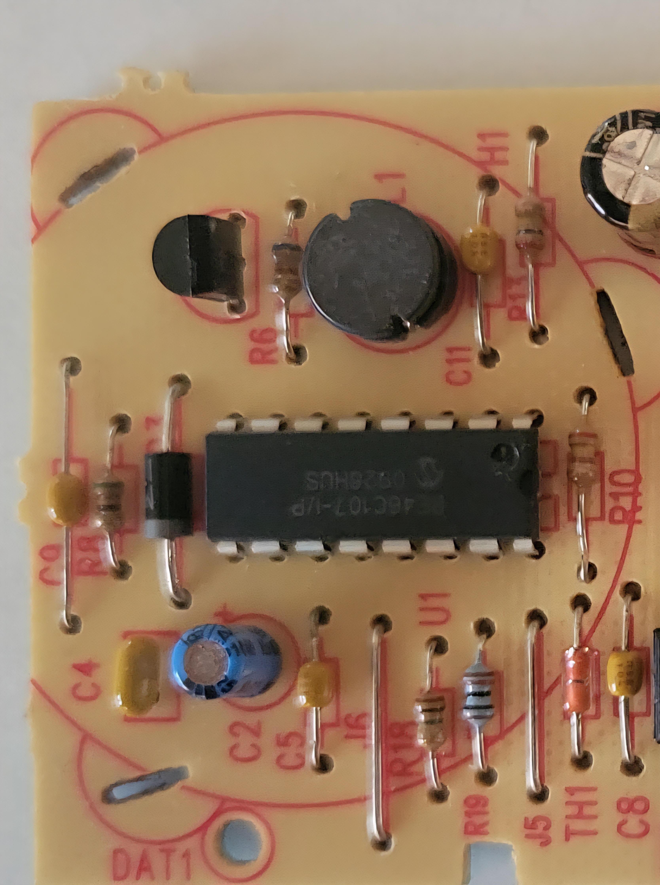
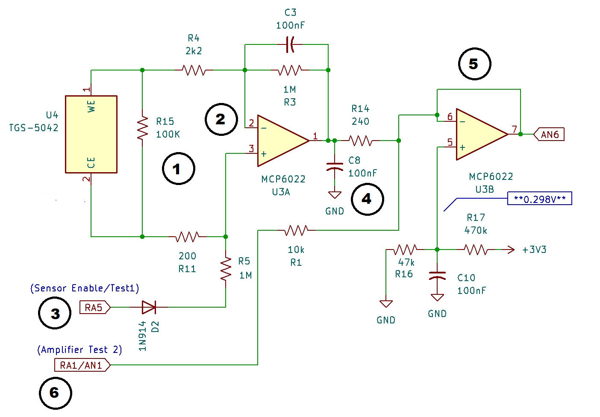

# First Alert CO Alarm (Model CO400) - Teardown
*A Work in Progress* 

  

## Overview
This device is a sensor and alarm device (ca. 2009) which has reached its end-of-life. I was curious what made it tick and was surprised to find an automated detection and  warning system that is a masterwork of low-power engineering design. It is not only just a humble consumer device but is a minuature automated chemistry lab, with a fuel cell!  It was manufatured by a company called **BRK Brands, Inc.**  So it is likely used in other CO detectors as well. 

  

The date: **2009 SEP 7** the chip date codes are also around this year. This device was indicating the five-chirp per minute warning: End-of-life. 

## Hardware Description
The hardware has several interesting, some unusual, and some familiar parts.  

  

### One moment please.. 
I did not kow what to expect, i was thinking it would be a simple sensor tied to a piezo beeper, but the device interested me so i decided to do a **bigclivedotcom** - style teardown! It was not as easy as i thought it would be to trace out such a "simple" PCB but it actually took several hours over a few days to complete. And...I am not sure it is 100% correct so,  take it with about a ~~pinch~~ pound of salt.

### The hardware 
- **TGS-5042** CO Sensor
- **PIC16F88** Microcontroller
- **MCP6042** Op amp
- **RE46C107** DC to DC Converter, Voltage Regulator and Piezoelectric Horn Driver

### Details and Test Software 
   - **Schematics!** PCB reverse engineering 
   - **Serial Data** Maybe, kind of?
   - **Software** For further investigations

## Figaro TGS5042 Sensor 

  

When I first saw this device I thought it was a battery. There was even about 0.5V between the terminals. This is the sensor.  It is a miniture lab consisting of fuel-cell-type electrochemical sensor that outputs a tiny current strictly linear to the Carbon Monoxide (CO) gas concentration. It turns out seeing voltage on the sensor pins when the board has no power supply is completely normal and expected for this specific component.

### It Has a Fuel Cell?

Yes, the **TGS5042** is a fuel cell type sensor. That is, it generates electricity from an electrolyte and a gas. It contains an aqueous alkaline electrolyte and an internal water reservoir. When target gas or residual gases are present, it literally generates its own micro-voltage and current. But it turns out, the electrolyte and water reservoir dry out after about 10-years, which is the state my sensor is in now. The datasheet and manual have lots of good info if you want to see more details.  

### Remember the number: 1642
Each sensor has a printed calibration number and matching barcode (see photo) This stands for 1.642nA/ppm for my sensor. This means that for every 1 part-per-million (ppm) of CO present, this sensor generates exactly 1.642 nanoamps of current.I will discuss reading this sensor in the OP Amp interface circuit description. 

The other code **090810** is likely the date code for: **10 August 2009** which is close to the manufactured date. 

## PIC16F688 (U2) Microcontroller Chip

  

Seeing this chip on the board is like being handed a secret decoder to the whole thing. While it is unlikely to be able to capture the existing code, we know what each pin does. *does the **"D"** stamped on TP1 mean checked for data?* 

### Features 
The **PIC16F688** is a 14-pin, 8-bit CMOS microcontroller from Microchip Technology featuring nanoWatt technology for low power consumption - ideal for this device.  Some of the key features/interfaces:
  - It includes 7KB of Flash program memory, 256 bytes of SRAM, and 256 bytes of EEPROM, supporting supply voltages from 2.0V to 5.5V.
  - This chip also supports low-power by switching off things like the Thermistor temperature sensor and the amplifiers to save power.
  - Since it is a saftey device it also provides a power-cycle with an NPN transistor switch (Q1) a PN2222 temporatily taking the battery voltage down trough (R6) controlled by a port (AN3) - proabibily on a watchdog timer?
  - It pulses the horn thru U1 (pin 14) via RC4 as well as controling some built in tests
  - The LED (D4) & Thermistor (TH1) are controlled simultaneously by pulling (RC0) Low.
  -  SW1 is the TEST/SILENCE button connected to input (RC5).
  -  Vbatt here is connected to (AN5) for battery voltage measurement.
  -  There is another circuit that seems to be a self-test consisting of (D1) (R2) (R12) and (C12) I am not exactly sure what this circuit does but it apparently uses Vbatt and is controlled by (RC3)  and (RC4) which is also the signal that enables the Siren. ~~TODO Retrace this circuit to try to find out what it does.~~ Done! see Note (6)

## MCP6042 (U3) Op Amp

  

### Score!  
When a chip company gets selected to go in a product they get a "socket" **Microchip** got two on this board the **PIC16F688** and  
The **MCP6042** are both from **Microchip Technology Inc.**  The **MCP6042** is a  high performance operational amplifier used in this device as a Transimpedance Amplifier (TIA) for current to voltage conversion. In this configuration the current from the sensor is forced to flow through the feedback resistor. The output voltage is calculated simply by multiplying the input current by the feedback resistor. The specifications for this op amp -like impedance characteristics and gain bandwidth- are ideal for applications, such as sensor conditioning. We will go into the details later in the detailed circuit description. 

### Key specifications include: 
   - Dual Amplifier in an 8-pin DIP Package
   - Low Quiescent Current: <1 µA (600 nA/amplifier typical)
   - Wide Supply Voltage Range: 1.4V to 6.0V
    
* The 1M Resistor and 100nF capacitor seen in the photo match the reference circuit from the **TGS-5042** Sensor documentaion. 

## The RE46C107 (U1)  DC to DC Converter, Voltage Regulator & Piezoelectric Horn Driver Chip

This is kind of a multipurpose specially chip. 

The **RE46C107** is manufactured R&E International *A Subsidiary of **Microchip Technology Inc.***  Is this a third and last "socket" *win?* Yes, I think it is a third win! 

This is an interesting chip I never heard of. The **RE46C107** is an ASIC intended for use in 3V battery powered products like Smoke Detectors and CO Alarms.

  

### Hidden in Plain sight 
This chip is located under the Piezo Horn, I had to remove the  piezoelectric to reveal it but the 16-pin DIP on the left side of the board is the **RE46C107**

### Alarming
The circuit features a DC-to-DC up-converter and driver circuit suitable for driving a piezoelectric horn. Oh, so that's how they get such a loud siren out of 3V batteries and there is a spec for alarm devices have to be so many dB (loud).  
### Boost it!
A selectable  3.0V or 3.3V A 5 Volt regulator is also provided for microprocessor voltage regulation. This curcuit uses the 3.3-Volt setting. 
### No Use
It also has a **LED Driver** and **low battery detection** but for some reasons these features were not used in this product. 

  

### Scope Out the Supporting Parts
This a microscope picture of the inductor, i was trying to get any indication of the values of the inductor and diode they used  - i assume that it matches the documtation's typical application circuit that use a 10 uH inductor.  Then there are a couple of rectifier diodes, which were installed with the part numbers down on the board.  The specs called for a Schottky diode (I chose a 1N5818 seems to fit the specs.)  There is another rectifier diode in the processor test circuits - not related to this chip- so i just used the same for that other diode. 

    App Notes: 
    - Inductor L1 must have maximum peak current rating of at least 1.5A and for best results should have DC resistance of less than 0.3 ohm.
    - Schottky diode D1 must have maximum peak current rating of at least 1.5A and for best results should have forward voltage spec of less than 0.5V at 1 Amp. 

### Key Specifications Include:
  - Low Quiescent Current - Low power design feature
  - 10V Boost Converter regulator - That's a lot of volts from a couple of 1.5 V AA batteries
  - Horn Driver - A complementary driver outputs HS and HB connect to the ceramic piezoelectric transducer, with a feedback pin as well.
  - Voltage Regulation for to 3.0V or 3.3V - It is set by a logic input used to set the Vreg output.
  - Voltage Regulation for +5 Volts - For logic circuits
  - Low Battery Detection - *not used in this circuit*
  - LED Driver- *not used in this circuit*

## Methods to My Madness:  
How I captured the schematic. Having the datasheets and reference circuits helped. The following two pictures were made to help. 

  

 
The solder side is mirrored and contrast enhanced - like viewing the board through the circuit side:

  

### X-ray Vision.
The plan was to overlay these with the component side semi-transparent and the solder side mirrored so I could see the traces throughthe component side. I had no editing software on hand that could do layers like this. So no X-ray vision needed.

I proceed to draw in the component outlines on a printout of the solder side and using continuity check on my DMM The contrast enhanced B&W print out, which was scaled up a bit helped - *...but an X-ray view would have been better.* 

### Buzzed it out
I used my multimeter to do point-to-point continuity tests and began to capture the circuits in KiCad using the reference circuits a guides. Since I started doing this before on the board from the solder side, I sometimes got the pin numbers wrong by starting on the wrong side of the chips! But it was easy to find and correct the errors using the reference documents. Assignment of component values was done later, with the help of component markings and measurements.  

### Board Takeover!
I originally considered reprogrmming the PIC16F688 controller.  The theory is that there is a end-of-life timer that just halts normal operation then there may still be some remaining sensitivity to the CO sensor that i could read.  The initial plan was to unsolder the chip and replace it with a 14-pin socket. This would allow not only to reprogram the chip off of the board but the socket also would alow me to jumper into an Arduino and run the sensor that way. Alternatively, simply soldering in short jumper wires to the pads after removing the chip would allow me to use a breadboard. 

### DFM & DFT
One other minor annoyance tracing the circuits was there are a lot of pads that do not support any particular components, and some components used long leads that pass over the pads, so i had to use the board to verify that they were just pads without component leads. My guess is they are for factory programming, calibration, and test or **Design For Manufacturing (DFM).** 

Another clue for **DFM**is there are a couple of large holes in the board. **(DAT1, DAT2)** these are not mounting holes but I suspect they are "datum?" holes for alignment pins for a pogo pin or "bed of nails" fixture.  Which brings up another idea - I bet all the signals for *In Circuit Programming* (ICP) are on these pads, along with other importaint signals. I probably should capture these on the schematic somehow,  although they are not labeled.

Oh, and i did go back and look at these, i can see the pin pricks right dead center on most of these. 

**Design For Test (DFT)** yes, we have lots of built in test on this board - more details on these later.

### Not My Problem
This effort was to see how this thing worked, not to copy or reproduce it.  ~~There are some errors i am aware of on the schematic i will probabily fix, and i still had some questions about power distribution etc.~~ Done, mostly addressed.

### the Schematic
Here is what i came up with. I  may update it if there are any other cool bits or mistakes i find, but as i said before this is most certaintly not complete but i never inteded to *copy or reproduce* the detector. 

  

~~Schematic TODO: Verify U3 V+ voltage and the voltage @ R17. - this will be critical to the ADC and reading of the sensor voltage.~~ **DONE** Notes: (1) (2) (3)
### Post-Apocalyptic? 
Hopefully, the schematic may be usefull to someone - **maybe as part of your next post-apocalyptic tricorder found junk device project?**

## Circuit Analysis:  
Most of the circuits have been explained in the previous secctions.  The reading of the **Figaro TGS5042** sensor (schematic U4, board SEN 1) is the heart of this device.  There are a few mathematical fomula are needed that get the %CO from the sensor. Due to regulatory requirements for safety devices these circuits have Built In System Tests (BIST) to meet those requirements, since the circuits contain them I will also explain these and wil provide some proposed Arduino sketches to help explain/implement this sensor. This is a little technical - it was mostly vibed. There are a couple of *"got-ya things"* that need to be addressed, such as the Reference voltage for the ADC, and temperature compensation. It is basically Ohm's Law but the current resolution for 1% PPM CO is a nano Ampere or about $$\frac{1}{\ 1,000,000,000}$$ of an AMP!  This needs to be converted to a voltage so the ADC on the PIC can read it. There following are all explained in more detail in the references- I will try to give a quick explanation here.

## 1. Sensor Current to Output Voltage ($V_{out}$)
The sensor generates a minute current proportional to gas concentration. An operational amplifier or load resistor is used to convert this current into a measurable voltage.  

### 2. Calculating Sensor Current ($I_s$)
To derive the raw sensor current in Amperes (A) from your circuit's measured output voltage, use the following formula:
$$I_s = \frac{V_{out} - 1.0}{1.0 \times 10^6}$$ 

### 3. Carbon Monoxide (CO) Concentration Calculation
To determine the absolute CO gas concentration in parts per million (ppm), divide the sensor output current by the sensor's individual sensitivity coefficient (measured in nA/ppm and found printed on the sensor's barcode).
$$\text{CO Concentration (ppm)} = \frac{\text{Sensor Output Current (nA)}}{\text{Sensor Sensitivity (nA/ppm)}}$$ 

### 4. Figaro Reference Formula
The official Figaro EM5042A Evaluation Module circuit applies a fixed amplification factor (1.0 × 10⁶) resulting in a 1.0V baseline offset in clean air.
$$V_{out} = (\text{Concentration} \times \text{Sensitivity}) + 1.0$$ 

## 5. Microprocessor Measurement Resolution
To evaluate the minimum measurable step of carbon monoxide resolution for our specific analog-to-digital converter (ADC) setup, apply:
$$\text{Resolution} = \frac{C_{max}}{2^M \times B_{min}}$$ 

  Where:
  
    * Cmax = Maximum target CO concentration
    * M = Number of microcontroller ADC bits (e.g., 10-bit, 12-bit)
    * Bmin = Minimum distinct digital bits required

## Interface Circuitry & Theory of Operation

OK with that out of the way, lets dig into some of these circuits. The TGS5042 carbon monoxide sensor generates a minute electrical current directly proportional to gas concentration. To process this signal safely and accurately, the circuit utilizes a dual operational amplifier (MCP6042) split into two distinct functional stages with the integrated Built-In Self-Test (BIST) diagnostics.

  

The numbers in this drawing refer to the paragraphs below. 

### 1. Anti-Polarization Shunt Circuit

 A big deal for just one  resistor. It was verified by reading the color code as measuring it would lead to incorrect result. see Notes below.
 ~~TODO: Need to check this resistor. I may have measured this value and the generated voltage may have interfered with the measurment, it seems pretty specfic~~ **DONE!** Note (5) 
 
* The 100kΩ resistor (R15) connected across the Working Electrode (WE) and Counter Electrode (CE).
* Electrochemical sensors can degrade permanently or suffer severe baseline drift if they hold an electrical bias while powered down. When the main system power is completely off, this resistor acts as a safe drain path. It maintains the potential between WE and CE at exactly 0V, preventing polarization damage.

### 2. Stage 1: Transimpedance Amplifier (TIA)

* Key Components:  MCP6042 Op-Amp (U3A) (First Stage: Pins 1, 2, 3), 1MΩ feedback resistor (R3), 100nF feedback capacitor (2.2kΩ (R4) / 220Ω (R11) ) act as isolation resistors.
* Function: This stage converts the sensor's raw nanoampere (nA) current into a readable voltage.
* Gain Control: The 1MΩ resistor (R3) sets the transimpedance gain. Because of this value, every 1 nA of sensor current translates to exactly 1 mV of voltage deviation at the output (Pin 1) the following circuits are needed.
   * Filtering: The 100nF parallel feedback capacitor acts as a low-pass filter to smooth out high-frequency environmental noise.
   * Protection: The 2.2kΩ and 220Ω inline resistors protect the delicate op-amp inputs against unexpected current spikes.

### 3. Sensor Diagnostic Test 1 (RA5)

* Circuit Path: Microprocessor Digital Pin → Diode (D2) Anode on MCU side → 1MΩ (R5) resistor → Pin 3 (Inverting Input). There small signal diode (D2) is probabily a 1N914 or 1N4148.
* Normal Mode: The MCU configures its digital pin as a High-Z Input (or holds it HIGH). This reverse-biases the diode, isolating the diagnostic branch completely so it does not affect gas readings.
* Self-Test Mode: The MCU drives this pin LOW. This pulls current away from Pin 3 through the 1MΩ resistor. The op-amp immediately compensates by driving its output (Pin 1) upward. The MCU checks for this predictable voltage step-up on the ADC to verify that the first stage op-amp loop is alive and electrically sound.

### 4. Inter-Stage RC Filter

* Key Components: 240Ω series resistor (R14), 100nF capacitor (C8) to Ground.
* Function: Located between the first stage output (Pin 1) and second stage input (Pin 6). This passive low-pass filter acts as a hardware noise barrier. It strips away high-frequency ripple and digital switching noise before the signal enters the ADC buffer.

### 5. Stage 2: Voltage Buffer & Baseline Offset

* Key Components: MCP6042 Op-Amp (U3B) Second Stage: Pins 5, 6, & 7.  The circuit is configured as a buffer with the (-) input tied to the output pin. A voltage Divider consisting of (R17) to $V_{CC}$ and (R16) to GND.
* Function: This stage isolates the measurement circuit from the microprocessor's ADC load while establishing a stable "clean air" baseline reference voltage.  The analog output is read on (AN6). 
* Voltage Divider (Pin 5): The 470kΩ (R17) and 47kΩ (R16) divider creates a permanent voltage offset on the non-inverting pin. For a 3.3V system, this sets a steady baseline reference point above the ground level.

- Why? Electrochemical sensors may sometimes exhibit negative baseline drift or minor reverse currents under specific temperatures or clean-air conditions. By adding the small offset voltage moves the "zero gas" signal a little above 0V which prevents the output signal from clipping against the ground rail, allowing the ADC to capture the full range even with any negative sensor drift accurately. 

### 6. ADC / Buffer Validation Circuit 2 (RA1/AN1)

* Circuit Path: Microprocessor Pin (RA1/AN1) → 10kΩ resistor (R1) → Pin 6 (U3B) The non-inverting input of the Buffer stage.
* Dual Functionality:
1. Buffer Diagnostics: If driven by a digital pin, the MCU can momentarily inject a test voltage into the buffer input. Observing the corresponding shift on the main ADC trace confirms that the second stage, the PCB trace, and the MCU's internal ADC hardware are completely intact.
2. Fast Stabilization Assist: Upon cold-booting, electrochemical sensors require time to settle. The MCU can temporarily configure this pin as an active output to rapidly charge the filter node to its steady-state voltage, sharply reducing the initial sensor warm-up time before flipping the pin back to a passive input state.
   
* Based on the transient response of the 10kΩ injection resistor and the 100nF filter capacitor, a single initialization pulse lasting exactly 560 microseconds (0.56 ms) will perfectly pre-charge the analog filter node to its steady-state clean-air operating baseline, eliminating the slow hardware startup lag.  

## Testing Methods, Notes & Results 

Including the *Serial data?* I found :  

    17:16:11.039 -> ==============================================
    17:16:11.087 ->    CO400 RAW PWM FRAME LOGGER v0.4.1 ACTIVE
    17:16:11.087 -> ==============================================
    17:16:13.576 -> 
    17:16:13.576 -> Δt=2541 ms  Bits=60  FRAME: 0x55 0xAA 0x4A 0x15 0x2A 0xA0 0x04 | CHK?=0x04
    17:16:18.319 -> Δt=4762 ms  Bits=59  FRAME: 0x55 0xAA 0x4A 0x15 0x2A 0xA0 0x04 | CHK?=0x04
    17:16:23.112 -> Δt=4760 ms  Bits=60  FRAME: 0x55 0xAA 0x4A 0x15 0x2A 0xA0 0x04 | CHK?=0x04
    17:16:27.856 -> Δt=4757 ms  Bits=61  FRAME: 0x55 0xAA 0x4A 0x15 0x2A 0x41 0x09 | CHK?=0x09
    17:16:32.612 -> Δt=4756 ms  Bits=61  FRAME: 0x55 0xAA 0x4A 0x15 0x2A 0x41 0x09 | CHK?=0x09
    17:16:37.373 -> Δt=4756 ms  Bits=61  FRAME: 0x55 0xAA 0x4A 0x15 0x2A 0x41 0x09 | CHK?=0x09
    17:16:42.551 -> Δt=5166 ms  Bits=61  FRAME: 0x55 0xAA 0x4A 0x15 0x2A 0x41 0x09 | CHK?=0x09
    17:16:47.284 -> Δt=4756 ms  Bits=61  FRAME: 0x55 0xAA 0x4A 0x15 0x2A 0x41 0x09 | CHK?=0x09
5
It is definately PWM data. We are not sure of the bit's polarity this preamble may also be: **0xAA 0x55 0xB5...** 
The patent referenced below does not include a list of codes, other than **10100101** meaning a carbon-monoxide alarm.
We should see that code **0xA5** But, we do not know if the implementations matc 100%. 
also we can see there are bits changing.  We will try to corrilate the changes to real world inputs.
  * Manual Test Button
  * Thermistor Test
  * Low Battery Simulation 
  * CO Test
  * 

### Notes and Comments 
* **Note (1): Measured 3v3 Power Rail (`VREG`):** Powered at **3.39V** (Configured via `REGSEL` Pin 9 tied HIGH to select the 3.3V power profile). This rail provides a quiet analog reference line for temperature sensing.
* **Note (2): Measured +5V Rail (`VO`):** Boosted to **4.54 V** via the chip's  DC-to-DC step-up circuit.
* **Note (3): Measured Op Amp Stage 2 Baseline Bias (Pin 5):** Biased to at factory to a baseline of exactly **0.298V**. This low-offset configuration provides maximum voltage headroom for incoming positive gas spikes while preventing ground-rail clipping.
* 
## (4) Corrected Schematic Values (3.3V System Target)
The color code on these two resistors were hard to read, and typical of precision restors, they had "extra" stripes. To manually replicate the verified *in-situ* baseline voltage of ~0.298V without utilizing non-standard values, substitute the theoretical divider values with standard 1% components:

* **  Top Divider Resistor (R17):** Swap out for a standard **487kΩ** (or **470kΩ** as a close alternative).
* **Bottom Divider Resistor (R16):** Swap out for a standard **47kΩ**.
* **Resulting Baseline:** Yields an explicit stable bias of **0.298V**, mirroring my production device's profile perfectly.
* Although this matches my unit, as long as the ADC Vref is set properly the standard ratio should be OK.
### (5) Anti-Polarization Shunt Circuit
* **Component:** `100kΩ` Resistor (R15) connected directly across the Working Electrode (**WE**) and Counter Electrode (**CE**).
* **Function:** Electrochemical cells naturally behave like tiny batteries and will drift or suffer permanent degradation if they hold an electrical charge while unpowered. This resistor acts as a safe drain path when the system is off, maintaining a strict 0V potential between the electrodes.
* **Bench-Testing Note:** I got lazy and tried to measure this resistor in-circuit using a standard Multimeter resistance setting. But the active chemistry of the TGS5042 injects a residual voltage into the traces, which skews the meter's test current and produces false, fluctuating resistance readings i got 600K which was a wierd value for a shunt.

### Note (6)  Battery monitering circuits. 
- **AN5**: is probabily for “static” battery monitor (slow ADC check of Vbat under light load / quiescent conditions).  
- I think the "mystery" Vbat circuit to **RC4 &  RC3/AN7** is a “dynamic” check while the horn is being driven. Everything else on the board is regulated and relatively light load, so the horn is the “worst‑case punch” to the cells, and this little network lets the PIC *watch* that punch in real time.  This is how it may work: 
  
* **Is the horn path actually working?**  
   - Drive RC4 → expect to see activity on RC3/AN7 through that RC network.  
   - If RC3 stays flat → open piezo, broken driver, etc.

* **How hard do the batteries sag under worst‑case load?**  
   - While RC4 is hammering the horn, sample AN7.  
   - Compare droop vs thresholds → decide low‑battery / EOL / fault.

## References & Resources

- BigClive teardown videos (excellent, entertaining tell him who sent you!)
  https://www.youtube.com/user/bigclivedotcom

- Figaro TGS5042 CO Sensor Datasheet
  https://www.figarosensor.com/product/docs/TGS%205042%20%281120%29.pdf
  
- Figaro APPLICATION NOTES FOR TGS5042
https://www.figarosensor.com/product/docs/tgs5xxx_application%20note(en)_rev01.pdf

- US Patent 6,791,453 — Interconnected Hazardous Condition Detectors
- Microchip MCP6021 Op‑Amp Datasheet
  https://ww1.microchip.com/downloads/en/DeviceDoc/20001685E.pdf

- PIC16F688 Datasheet (microcontroller used in CO400)

   https://ww1.microchip.com/downloads/en/DeviceDoc/41203F.pdf

- US Patent 6,791,453 — Interconnected Hazardous Condition Detectors
  https://patents.google.com/patent/US6791453B1/en

https://gist.github.com/darconeous/b55d9d1c01ac67f356d86f82a56a6271
